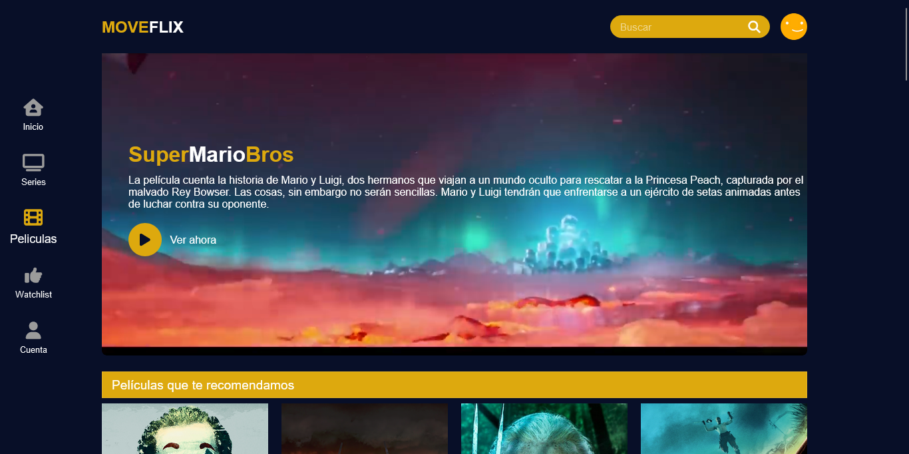

# Proyecto Final Codo A Codo 

Este proyecto creado para el curso de Desarrollador Web Full Stack Python, realizado en Codo A Codo. Es parte de un proyecto final que pone en practica 
lo aprendido en la primera parte del curso (Front-End), el mismo fue realizado en grupo de a tres. 
El mismo es una página web para poder ver contenido (Películas, Series, Programas de Televisión, Eventos Deportivos, etc.), entre sus características 
podemos destacar que es 100% responsive y se adapta a cualquier dispositivo, brindando la misma calidad y fluidez en cualquier parte.

### Capturas de Pantalla:

Primera parte de la página web:

Peliculas:

Series:

Login(Falta Inplemetar):

Imagenes de la Web en dispositivos de menor tamaño:

## Tecnologías

Esta página web fue creada con:

* HTML
* CSS
* JavaScript
* Bootstrap 5(Sola la parte para enviar el Formulario)

Además, se incluyeron **Google Fonts** para personalizar la fuente y **fontawesome** para incorporar íconos como flechas y logos de redes sociales populares. 

## Español 

El texto de la página web está escrito en español, al igual que las clases y atributos personalizados(Hay algunas clases en inglés).

## Ver Proyecto en Vivo

Puedes acceder al proyecto en vivo en: https://moveflix.netlify.app/

